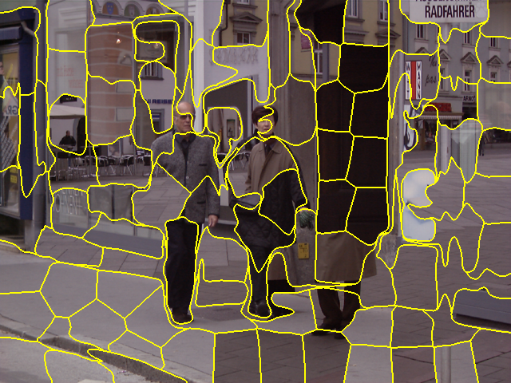
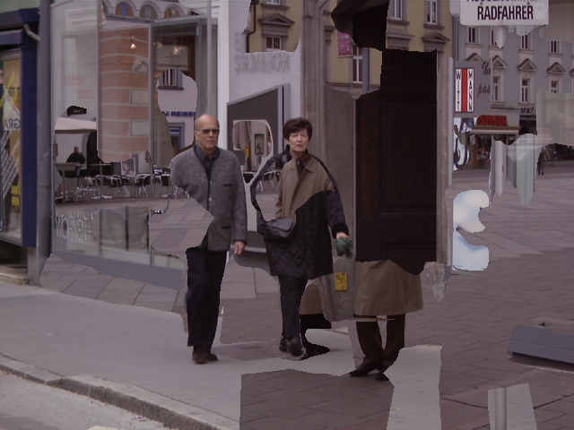

# SuperpixelGridMasks

</img>

# What is SuperpixelGridMasks?

SuperpixelGridMasks is a data augmentation approach which permits to generate various complementary images from original sensor-based data of varied natures e.g. X-Ray scans,  vehicular scenes, people images (see data samples). This approach allows to increase the size of your image-based training datasets towards expecting better performances in your analysis tasks. Experiments have shown that the approach can be efficient for image classification tasks. This work is currently under review. Once reviewed, source codes will be publicly made available online. 

For more details about this work:

`Update April 16, 2022:` 

> Karim Hammoudi, Adnane Cabani, Bouthaina Slika, Halim Benhabiles, Fadi Dornaika and Mahmoud Melkemi. SuperpixelGridCut, SuperpixelGridMean and SuperpixelGridMix Data Augmentation. 2022. hal-03639460. (pre-print being indexed by the HAL platform, will be accessible soon)
>  <a href=https://hal.archives-ouvertes.fr/hal-03639460>https://hal.archives-ouvertes.fr/hal-03639460</a>


# Augmentation examples


## Samples of augmented X-Ray scans  ###(generated from the Kaggle dataset Chest X-ray Images (Pneumonia))

<p align="center">
<div align="center">
<b>X-ray scans (q=1000, r=0.4, with boundaries)</b></div> 
</p>

<table>
<tr>
<td> <br><div align="center">Image 1</div> </td>
<td><br><div align="center">SuperpixelGridCut</div></td>
  <td><br><div align="center">SuperpixelGridMean</div></td>
  <td><br><div align="center">Image 2</div></td>
  <td><br><div align="center">SuperpixelGridMix</div></td>
</tr>
</table>

<p align="center">
<div align="center">
<b>X-ray scans (q=1000, r=0.4, without boundaries)</b></div> 
</p>

<table>
<tr>
<td><br><div align="center">Image 1</div> </td>
<td><br><div align="center">SuperpixelGridCut</div></td>
  <td><br><div align="center">SuperpixelGridMean</div></td>
  <td><br><div align="center">Image 2</div></td>
  <td><br><div align="center">SuperpixelGridMix</div></td>
</tr>
</table>

## Samples of augmented vehicular images (generated from a PASCAL VOC benchmark dataset)

<p align="center">
<div align="center">
<b>Vehicle images (q=200, r=0.4, with boundaries)</b></div> 
</p>

<table>
<tr>
<td> <br><div align="center">Image 1</div> </td>
<td><br><div align="center">SuperpixelGridCut</div></td>
  <td><br><div align="center">SuperpixelGridMean</div></td>
  <td><br><div align="center">Image 2</div></td>
  <td><br><div align="center">SuperpixelGridMix</div></td>
</tr>
</table>

<p align="center">
<div align="center">
<b>Vehicle images (q=200, r=0.4, without boundaries)</b></div> 
</p>

<table>
<tr>
<td><br><div align="center">Image 1</div> </td>
<td><br><div align="center">SuperpixelGridCut</div></td>
  <td><br><div align="center">SuperpixelGridMean</div></td>
  <td><br><div align="center">Image 2</div></td>
  <td><br><div align="center">SuperpixelGridMix</div></td>
</tr>
</table>

## Samples of augmented people images (generated from a PASCAL VOC benchmark dataset)

<p align="center">
<div align="center">
<b>Pedestrian images (q=100, r=0.4, with boundaries)</b></div> 
</p>

<table>
<tr>
<td>
<br>
<div align="center">Image 1</div>
</td>
<td>
<br>
<div align="center">SuperpixelGridCut</div>
</td>
<td><br>
<div align="center">SuperpixelGridMean</div>
</td>
<td><br><div align="center">Image 2</div></td>
<td><br>
<div align="center">SuperpixelGridMix</div>
</td>
</tr>
</table>

<p align="center">
<div align="center">
<b>Pedestrian images (q=100, r=0.4, without boundaries)</b></div> 
</p>

<table>
<tr>
<td>
<br>
<div align="center">Image 1</div>
</td>
<td>
<br>
<div align="center">SuperpixelGridCut</div>
</td>
<td><br>
<div align="center">SuperpixelGridMean</div>
</td>
<td><br><div align="center">Image 2</div></td>
<td><br>
<div align="center">SuperpixelGridMix</div>
</td>
</tr>
</table>

<table>
<tr>
<td width="150px">
<br>
<div align="center">Image 1</div>
</td>
<td width="150px">
<br>
<div align="center">SuperpixelGridCut</div>
</td>
<td width="150px"><br>
<div align="center">SuperpixelGridMean</div>
</td>
<td width="150px"><br>
  <div align="center">Image 2</div></td>
<td width="150px"><br>
<div align="center">SuperpixelGridMix</div>
</td>
</tr>
</table>

# Team

<b>Project leaders: </b>

- Karim Hammoudi, Université de Haute-Alsace, IRIMAS, [karim.hammoudi@uha.fr](mailto:karim.hammoudi@uha.fr)

- Adnane Cabani, ESIGELEC/IRSEEM, [adnane.cabani@esigelec.fr](mailto:adnane.cabani@esigelec.fr)

Note: project leaders equally contributed to this work.

<b>Contributors: </b>

- Bouthaina Slika, University of the Basque Country, Spain, [bslika001@ikasle.ehu.eus](mailto:bslika001@ikasle.ehu.eus)

- Halim Benhabiles, Yncrea Hauts-de-France, IEMN Lille, [halim.benhabiles@yncrea.fr](mailto:halim.benhabiles@yncrea.fr)

- Fadi Dornaika, University of the Basque Country \& IKERBAQUE foundation, [fadi.dornaika@ehu.es](mailto:fadi.dornaika@ehu.es)

- Mahmoud Melkemi, Université de Haute-Alsace, IRIMAS, [mahmoud.melkemi@uha.fr](mailto:mahmoud.melkemi@uha.fr)


# Bibtex references

> Karim Hammoudi, Adnane Cabani, Bouthaina Slika, Halim Benhabiles, Fadi Dornaika and Mahmoud Melkemi. SuperpixelGridCut, SuperpixelGridMean and SuperpixelGridMix Data Augmentation. 2022. hal-03639460. (pre-print being indexed by the HAL platform, will be accessible soon)
>  <a href=https://hal.archives-ouvertes.fr/hal-03639460>https://hal.archives-ouvertes.fr/hal-03639460</a>

```
@MISC{hammoudi:hal-03639460,
  TITLE = {{SuperpixelGridCut, SuperpixelGridMean and SuperpixelGridMix Data Augmentation}},
  AUTHOR = {Hammoudi, Karim and Cabani, Adnane and Slika, Bouthaina and Benhabiles, Halim and Dornaika, Fadi and Melkemi, Mahmoud},
  URL = {https://hal.archives-ouvertes.fr/hal-03639460},
  NOTE = {preprint},
  YEAR = {2022},
  MONTH = Apr,
  PDF = {https://hal.archives-ouvertes.fr/hal-03639460/file/article_superpixelgridmasks.pdf},
  HAL_ID = {hal-03639460},
  HAL_VERSION = {v1},
}
