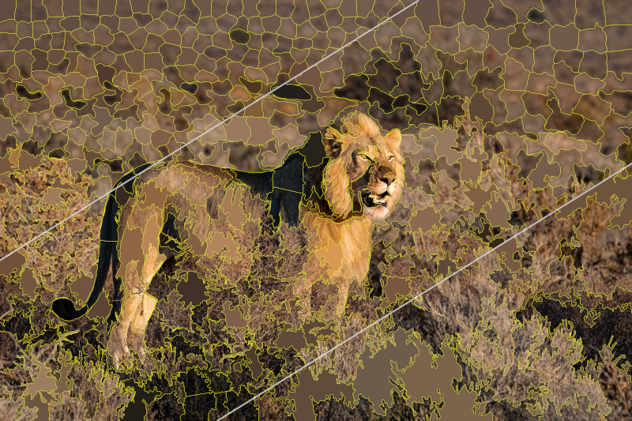
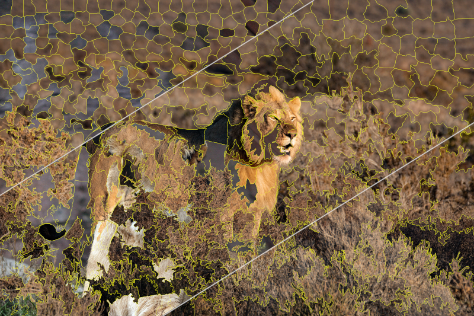

# SuperpixelGridMasks

</img>

# What is SuperpixelGridMasks?

SuperpixelGridMasks is a data augmentation approch which permits to generate various complementary data from original sensor data (e.g. scans, photos, maps, multi-modal data). This approach allows to increase the size of your training datasets towards expecting better performances in your image recognition tasks.  This work is currently under review. Once validated, source codes will be publicly made available online. 

For more details about this work:

`Update April 16, 2022:` 

> Karim Hammoudi, Adnane Cabani, Bouthaina Slika, Halim Benhabiles, Fadi Dornaika and Mahmoud Melkemi. SuperpixelGridCut, SuperpixelGridMean and SuperpixelGridMix Data Augmentation. 2022. hal-03639460. (pre-print being indexed by the HAL platform, will be accessible soon)
>  <a href=https://hal.archives-ouvertes.fr/hal-03639460>https://hal.archives-ouvertes.fr/hal-03639460</a>


# Augmentation examples

<p align="center">
<div align="center">
</img><br>
<b>Image 1</b></div> 
</p>

<p align="center">
<div align="center">
</img><br>
<b>SuperpixelGridCut (q=100, q=500, q=1000, r=0.2)</b></div> 
</p>

<p align="center">
<div align="center">
</img><br>
<b>SuperpixelGridMean (q=100, q=500, q=1000, r=0.2)</b></div> 
</p>


<p align="center">
<div align="center">
</img><br>
<b>Image2</b></div> 
</p>

<p align="center">
<div align="center">
</img><br>
<b>SuperpixelGridMix (q=100, q=500, q=1000, r=0.2)</b></div> 
</p>


# Team

<b>Project leaders: </b>

- Karim Hammoudi, Université de Haute-Alsace, IRIMAS, [karim.hammoudi@uha.fr](mailto:karim.hammoudi@uha.fr)

- Adnane Cabani, ESIGELEC/IRSEEM, [adnane.cabani@esigelec.fr](mailto:adnane.cabani@esigelec.fr)

Note: project leaders equally contributed to this work.

<b>Contributors: </b>

- Bouthaina Slika, University of the Basque Country, Spain, [bslika001@ikasle.ehu.eus](mailto:bslika001@ikasle.ehu.eus)

- Halim Benhabiles, Yncrea Hauts-de-France, IEMN Lille, [halim.benhabiles@yncrea.fr](mailto:halim.benhabiles@yncrea.fr)

- Fadi Dornaika, University of the Basque Country \& IKERBAQUE foundation, [fadi.dornaika@ehu.es](mailto:fadi.dornaika@ehu.es)

- Mahmoud Melkemi, Université de Haute-Alsace, IRIMAS, [mahmoud.melkemi@uha.fr](mailto:mahmoud.melkemi@uha.fr)


# Bibtex references

> Karim Hammoudi, Adnane Cabani, Bouthaina Slika, Halim Benhabiles, Fadi Dornaika and Mahmoud Melkemi. SuperpixelGridCut, SuperpixelGridMean and SuperpixelGridMix Data Augmentation. 2022. hal-03639460. (pre-print being indexed by the HAL platform, will be accessible soon)
>  <a href=https://hal.archives-ouvertes.fr/hal-03639460>https://hal.archives-ouvertes.fr/hal-03639460</a>

```
@MISC{hammoudi:hal-03639460,
  TITLE = {{SuperpixelGridCut, SuperpixelGridMean and SuperpixelGridMix Data Augmentation}},
  AUTHOR = {Hammoudi, Karim and CABANI, Adnane and Slika, Bouthaina and Benhabiles, Halim and Dornaika, Fadi and Melkemi, Mahmoud},
  URL = {https://hal.archives-ouvertes.fr/hal-03639460},
  NOTE = {working paper or preprint},
  YEAR = {2022},
  MONTH = Apr,
  PDF = {https://hal.archives-ouvertes.fr/hal-03639460/file/article_superpixelgridmasks.pdf},
  HAL_ID = {hal-03639460},
  HAL_VERSION = {v1},
}
